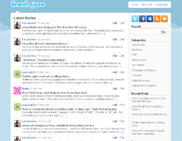

# Twitterize
A Twitter like free WordPress theme.

## Installation:
1. Download "**twitterize.zip**" file and upload it into WordPress using "Add New" under themes section in WP admin. 
2. Activate the theme.

OR

1. Download and extract "**twitterize.zip**" file, upload the "christmas" folder to '/wp-content/themes/' directory in your web server.
2. Log in to the WordPress Administration Dashboard
3. Select the 'Themes' sub-menu from 'Appearance' menu
4. Select the 'Twitterize' theme from the available list of themes to preview
5. Activate the theme.

OR

Watch this video: https://youtu.be/4-65ohSj55c	
	
## Please help me, I'm stuck!
------------------------------------
We all know people need help with editing from time to time, which is why I offer free help in numerus way's. If you  need support please post  herer https://linesh.com/forums/forum/themes/twitterize/
	

## License
This theme is licensed under [GNU General Public License v2 (or later)](./LICENSE.md).

	::::::::::::::::::::::::::::::::::::::::::::::::::::::::::::::::::::::::::::::::::::
	::                     Thanks for downloading. Have a good day!                   :: 
	:::::::::::::::::::::::::::::::::::::::::::::::::::::::::::::::::::::::::::::::::::: 
